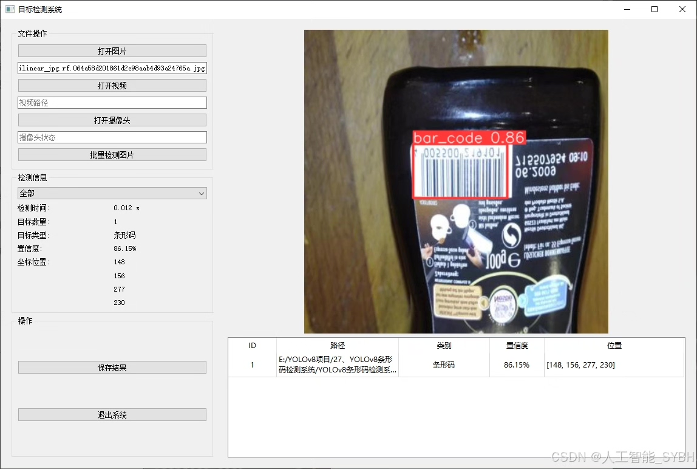
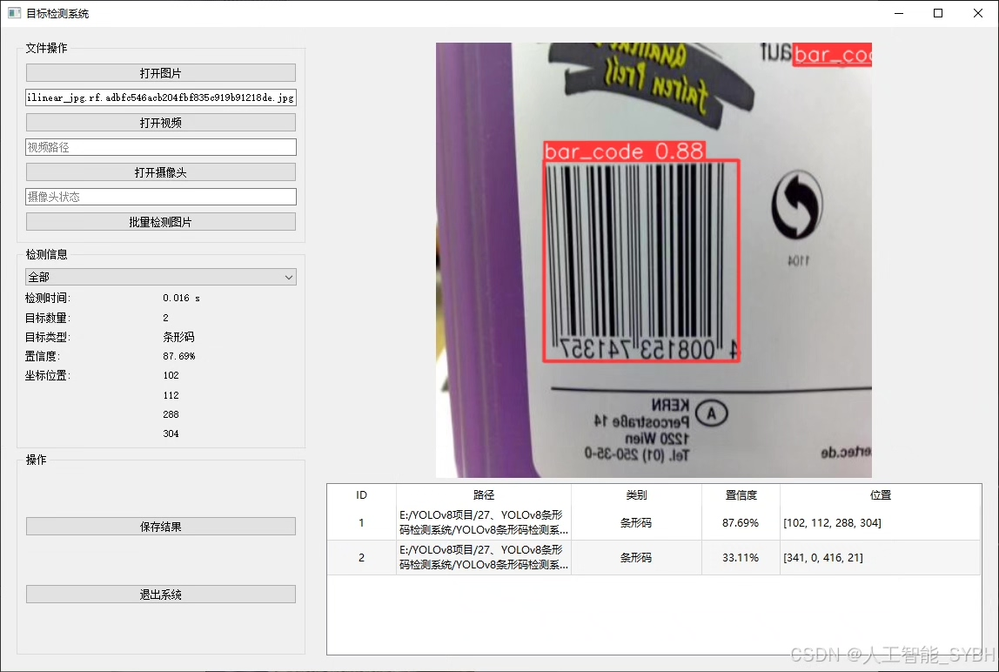
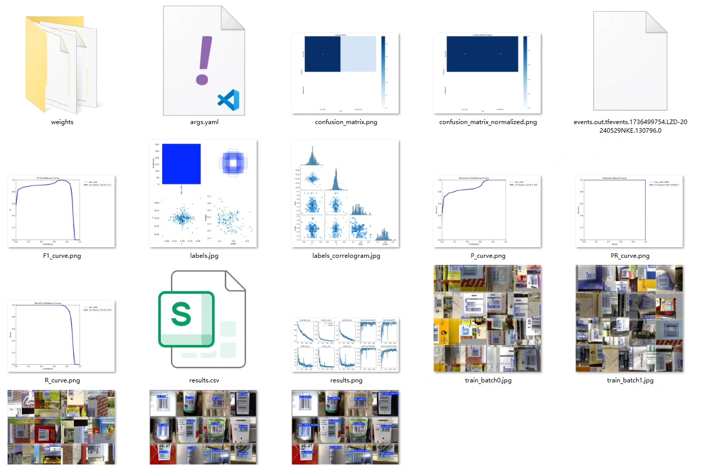
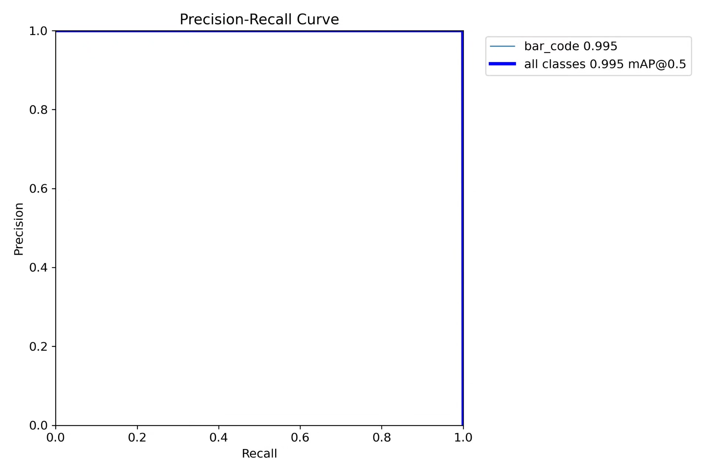
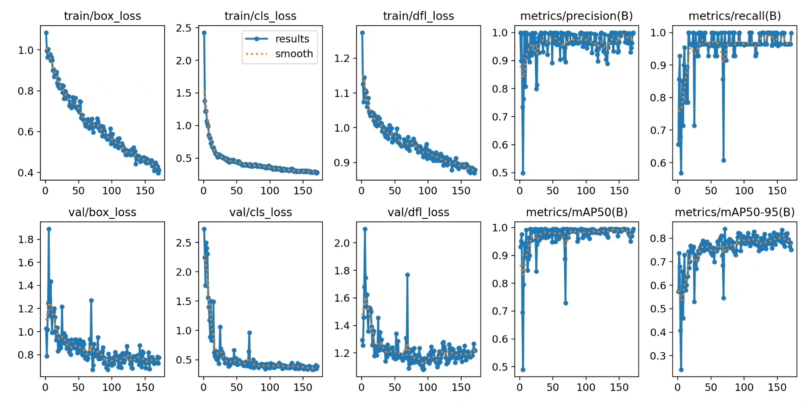
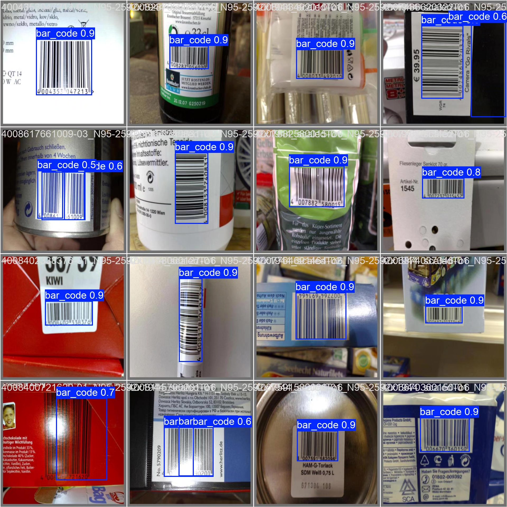
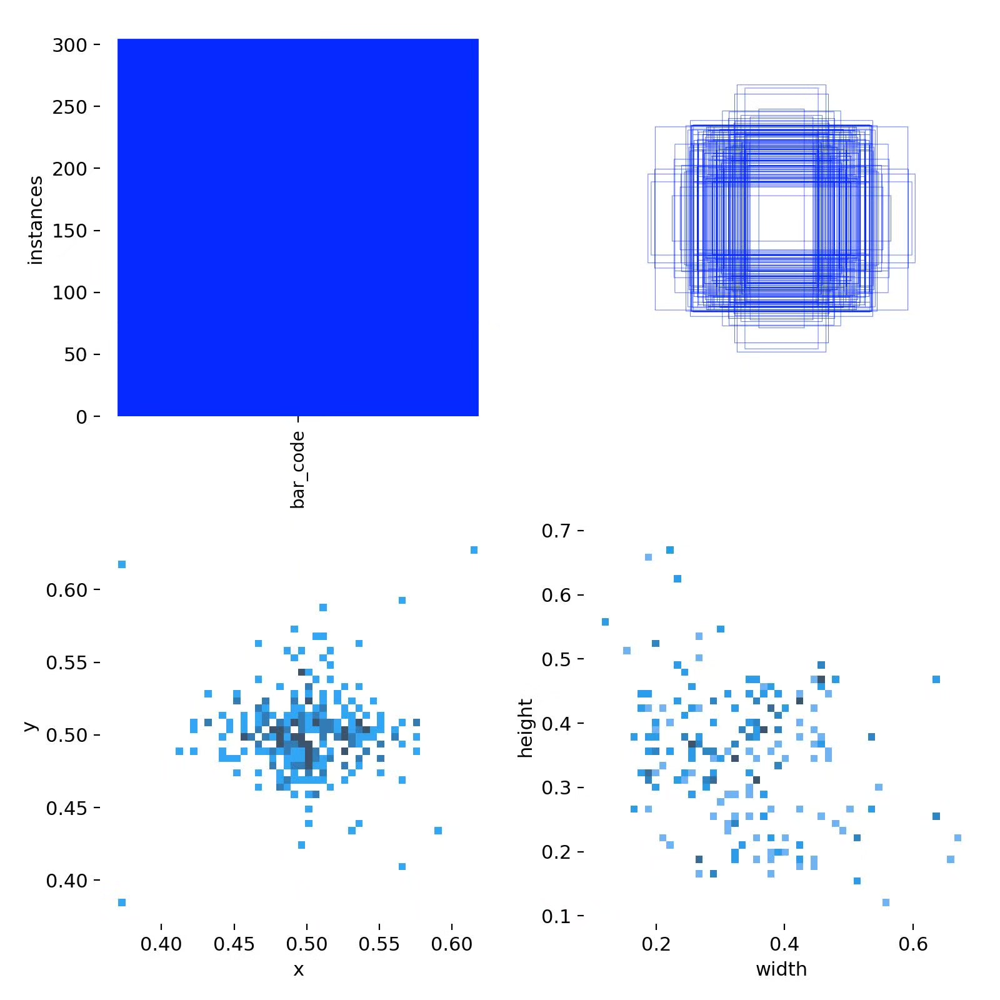
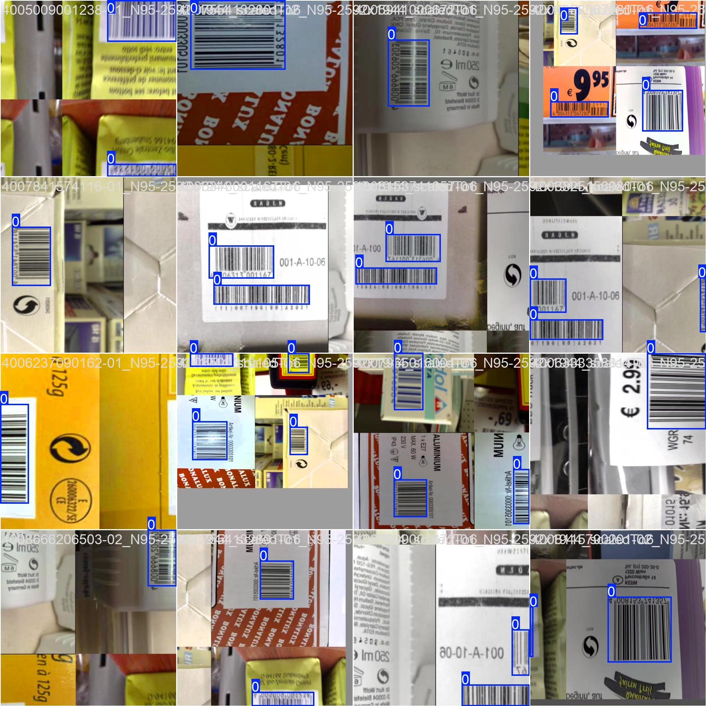

# Barcode detection system based on YOLOv8 deep learning (YOLOv8+YO)

## Body

Based on the advanced YOLOv8 (You Only Look Once version 8) object detection algorithm, this project has developed a highly efficient and precise barcode detection system. The system is optimized for a single category (bar_code), using custom datasets for training and validation. YOLOv8, as one of the latest versions in the YOLO series, achieves a good balance between detection speed and accuracy, allowing for rapid localization and recognition of barcode regions in images or video streams. This system can be widely applied in fields such as retail, logistics, warehouse management, and industrial automation, achieving real-time detection and recognition of barcodes, significantly improving work efficiency and reducing labor costs.

The company's products have been granted commercial license certification by YOLO.

We provide after-sales service.

After payment, we will provide WeChat IDs to answer questions at any time.

Environment configuration: We will provide an environment configuration tutorial, and WeChat will provide answers to questions.

Remote installation services: If you need remote configuration, an additional fee of 69 is required, with all fees refunded if the configuration fails (only refunding installation fees for older computers).

Retraining dataset: After setting up the environment, you can train on your own computer. If you need us to retrain, just pay 69 plus computing power fees (2.5 yuan/hour).

Full after-sales service

## Images

## Payment

Here is a pay link on Stripe ( https://buy.stripe.com/3cs8yP7sY87d0vu9AB ). Please contact me lonlonago@foxmail.com after funding $89, and I will send you a complete data files , thank you!

